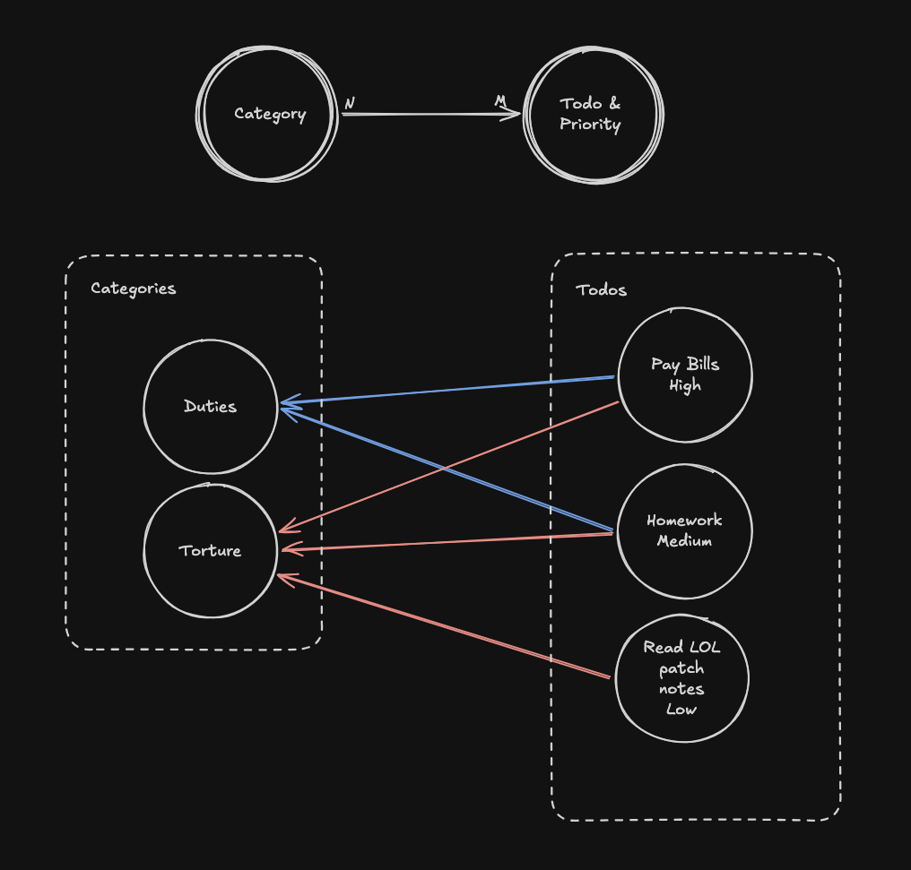

# Entities

These are the entities that live within our TODO app. In a layered architecture, these would
be considered our domain types. We have used these types directly within the codebase due to the
scale of the application.

## Todo

An object representing something the user needs to do. Identified by a surrogate key automatically
generated by the database.

Properties:

- Name is NOT unique
- Completion status
- Holds all categories the Todo belongs to
- Holds a priority
- Optionally has a due date, stored in UTC timezone as an optional string for serialization purposes and to avoid timezones

## Priority

An enum representing the priority of each Todo. Used to determine the order of Todos presented.

Properties:

- Represented by integers, with HIGH having value 7 and NONE having value 0
- NONE by default
- Sorted in descending order
- Represented with an integer directly within a Todo

## Category

An object representing a user-created category. Also identified by a surrogate key, but the name must be unique.

## High-Level Diagram

